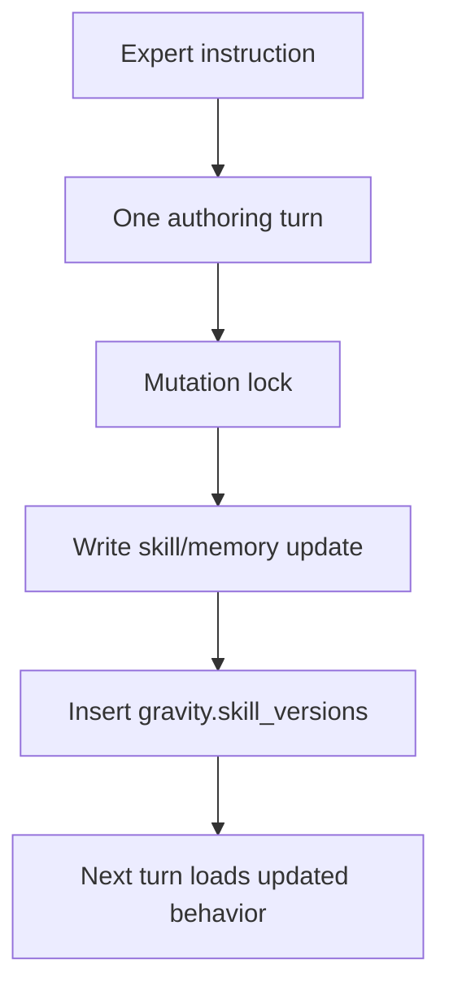

# TEMP: CP8 Self-Authoring Explainer (Simplified)

Last Updated: 2026-02-19
Status: temporary explainer
Owner: kevin + codex

## Why this doc exists
This explains CP8 in product terms and implementation terms with simplified language:
- what "self-authoring" means in MVP,
- why we are using a mutation transaction model,
- what we borrowed from `pi-mom` and `openclaw`,
- what is implemented now and what is next.

## Executive Summary
- CP8 is about expert-taught self-updates: agents update their own skills/memory and log that evolution.
- For pre-demo, this is modeled as a single self-authoring mutation transaction, not a complex multi-turn orchestration loop.
- We keep minimal concurrency controls only where needed: lock + FIFO queue for conflicting writes.
- `pi-coding-agent` is the shared execution substrate used by both `pi-mom` and `openclaw`; Gravity builds control-plane behavior around it.

## What "Self-Authoring" means in MVP
Self-authoring means:
1. A teammate teaches the agent in natural language.
2. The agent generates an updated skill/memory delta.
3. Gravity applies durable updates to `store/`.
4. Gravity logs evolution in `gravity.skill_versions`.
5. Next turn loads the updated skill/memory behavior.

## Product Situations Where This Is Useful

| Situation | Without CP8 | With CP8 |
| --- | --- | --- |
| Compliance lead teaches a new rule | Rule sits in chat and is forgotten | Rule becomes durable skill update immediately |
| Analyst correction to SQL interpretation | Behavior drifts across threads | Updated skill is reused by everyone |
| Two teammates teach same agent at once | File-write collisions and inconsistency | Lock + queue serialize updates safely |
| Slack retries duplicate teach event | Double apply of same update | Trigger dedupe prevents duplicate mutation |
| Bad update introduced | Hard to trace what changed | `gravity.skill_versions` gives explicit audit trail |

## What we implemented in docs now
- CP8 completed plan is centered on mutation transactions and auditability:
  - `docs/plans/completed/2026-02-19-cp8-self-authoring-runtime-loop.md`
- CP8 interfaces are now mutation-oriented:
  - `SelfAuthoringMutationCoordinator`
  - `SelfAuthoringMutationQueue`
  - `SelfAuthoringMutationApplier`
  - `SkillVersionAuditStore`
  - `docs/architecture/interfaces.md`

## Why we simplified (and removed heavy "loop" framing)
- MVP requirement is "experts teach agents directly, no eng cycle required."
- That outcome does not require a complex multi-step autonomous loop state machine.
- It does require deterministic mutation apply and clear auditability.
- So pre-demo architecture should optimize for clarity and reliability of teach/apply/track.

## Concrete Decisions We Made
1. CP8 is a self-authoring mutation flow, not a generalized orchestration engine.
2. Concurrency control is narrow:
- Per-agent mutation lock scope.
- FIFO queue for conflicting updates.
3. Dedupe stays mandatory:
- Duplicate trigger key is dropped before mutation.
4. Post-demo concerns are deferred:
- cross-agent fairness budgets,
- distributed multi-instance locking,
- richer orchestration semantics.
5. Mutation scope is strict:
- Allowed: `store/shared/skills/*` and `store/agents/{agentId}/memory/MEMORY.md`.
- Disallowed: code, resources/connectors, DB schema/migrations, and agent-definition updates.

## Boundaries

### Mutation boundaries
- Durable writes only to:
  - `store/shared/skills/*`
  - `store/agents/{agentId}/memory/MEMORY.md`
- Every successful skill mutation writes to `gravity.skill_versions`.
- Any non-allowlisted mutation target is rejected fail-closed (`mutation_policy_denied`).

### Control-plane boundaries
- `pi-coding-agent` handles session/turn primitives.
- Gravity handles policy, locking, mutation apply, and audit recording.

### Scope boundaries (pre-demo)
- Keep single-process assumptions.
- No distributed lock manager yet.
- No advanced scheduler/fairness logic yet.

## How `pi-mom` and `openclaw` do related work

## `pi-mom`
- Uses `AgentSession` and `SessionManager` from `@mariozechner/pi-coding-agent`.
  - `/Users/kevingalang/code/pi-mono/packages/mom/src/agent.ts`
- Reloads skills/memory from disk each run.
- Has simple in-memory run gating per channel (`running` flag).
  - `/Users/kevingalang/code/pi-mono/packages/mom/src/main.ts`

Takeaway for Gravity:
- Great baseline for turn/session execution.
- Needs explicit control-plane mutation contracts and audit linkages for CP8 thesis.

## `openclaw`
- Also depends on `@mariozechner/pi-coding-agent`.
  - `/Users/kevingalang/code/openclaw/package.json`
- Wraps coding tools and session transcript behavior with broader control-plane surfaces.
  - `/Users/kevingalang/code/openclaw/src/agents/pi-tools.ts`
  - `/Users/kevingalang/code/openclaw/src/config/sessions/transcript.ts`
- Adds richer orchestration features (`mesh`, `sessions_send`, cron/wake).

Takeaway for Gravity:
- Keep using pi-coding-agent primitives.
- Build only the control-plane layer needed for MVP self-authoring proof.

## Why pi-coding-agent is the key shared component
`pi-coding-agent` is the common runtime substrate that already provides:
- session transcript primitives (`SessionManager`),
- turn/session execution wrapper (`AgentSession`),
- coding tools (`read`, `write`, `edit`, etc.),
- compaction/retry event surfaces.

Gravity should not reimplement that core.
Gravity should implement CP8-specific control-plane behavior around it:
- teach intent detection,
- deterministic mutation apply,
- conflict serialization,
- skill evolution audit trail.

## Next work (implementation slices)
1. Teach/update intent detection path.
2. Single-turn mutation payload contract.
3. Mutation lock + FIFO queue.
4. Durable mutation apply path.
5. `gravity.skill_versions` audit writes.
6. CP8 verification harness and matrix.

## Post-demo expansion areas
1. Distributed locks for multi-instance deployments.
2. Cross-agent fairness and scheduling budgets.
3. Richer multi-step self-authoring orchestration if truly needed by product behavior.
