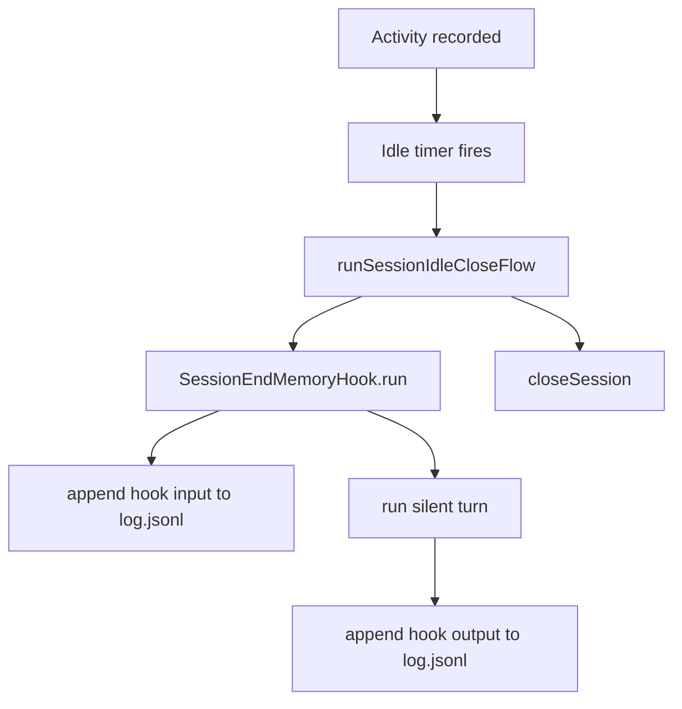
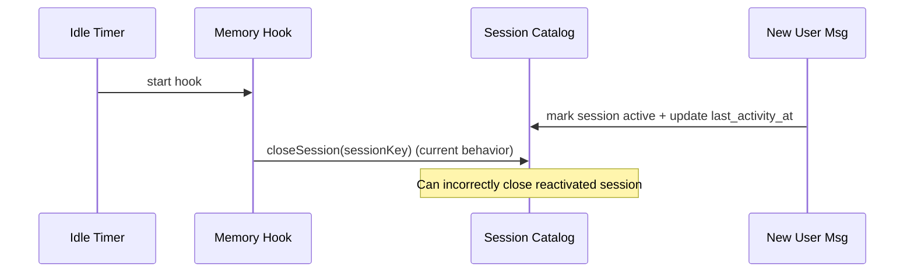
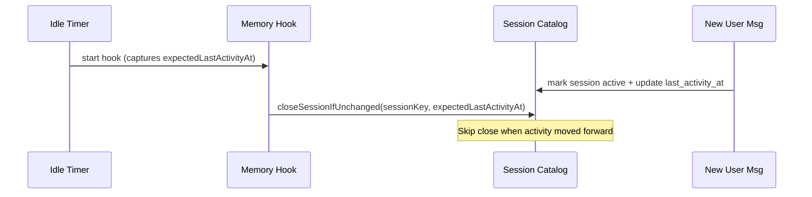

# TEMP: OpenClaw vs Gravity Session/Context/Memory Strategy

Last Updated: 2026-02-19
Status: temporary comparison note
Owner: kevin + codex

## Why this doc exists
This is a product-and-architecture explainer for:
- how OpenClaw handles session/context/memory (including `memory-lancedb` auto-capture),
- how Gravity currently handles CP7 session-end memory hook,
- what tradeoffs we are choosing and why,
- what we have implemented now vs what we should do next.

## Executive Summary
- OpenClaw default behavior is **not** continuous long-term auto-capture. It uses:
  - normal session history + memory files,
  - optional pre-compaction silent memory flush,
  - explicit memory writes when prompted.
- OpenClaw `memory-lancedb` plugin adds optional **auto-recall + auto-capture on `agent_end`**.
- Gravity CP7 currently uses **session-end memory hook on idle close**.
- Two correctness gaps were identified in review:
  - P1: internal memory-hook prompt can leak into future context replay.
  - P2: stale idle callback can close a session that was reactivated during hook latency.
- Recommended immediate direction: keep CP7 shape, patch P1/P2, then evaluate whether we also want an optional always-on auto-capture mode.

## OpenClaw: How `memory-lancedb` Auto-Capture Works

### Activation
- Plugin must be selected in memory slot (`plugins.slots.memory = "memory-lancedb"`).
- Config has:
  - `autoRecall` (default true),
  - `autoCapture` (default false unless enabled),
  - `captureMaxChars` bounds.

### Hook points
- `before_agent_start`:
  - embeds current prompt,
  - vector-searches prior memories,
  - prepends `<relevant-memories>` context block.
- `agent_end`:
  - inspects completed run messages,
  - captures candidate user facts/preferences/decisions into LanceDB.

### Capture algorithm (high level)
1. Read only `user` messages from the completed run.
2. Filter by heuristics:
   - min/max length,
   - trigger patterns (remember/prefer/decision/entity-like hints),
   - skip suspicious prompt-injection-like content.
3. Embed candidate text.
4. De-duplicate by similarity (very high threshold).
5. Store up to a small capped count per run (currently 3).

### Why it matters
- Captures durable signals even when a session never reaches compaction.
- Reduces dependence on explicit "please remember this" behavior.
- Introduces probabilistic capture risk (false positives/false negatives), so it needs guardrails and observability.

## OpenClaw Overall: Session + Context + Memory

### Session lifecycle
- Fresh/stale is decided at **inbound message time**, not by delayed close callbacks.
- If stale (daily/idle policy), mint new `sessionId`; otherwise continue same session.
- This avoids a class of stale-close races.

### Context persistence
- Session store + transcript model:
  - store metadata (`sessions.json`),
  - append-only transcript (`*.jsonl`) for model context reconstruction.
- Run execution is serialized by lane + session write lock.

### Memory model
- Default memory plugin (`memory-core`) gives memory tools (`memory_search`, `memory_get`) and file-backed memory.
- Optional pre-compaction silent memory flush runs near compaction threshold.
- Optional `memory-lancedb` adds auto-recall/auto-capture.

## Gravity Current (CP7): Session-End Memory Hook

### Runtime shape today

### What is implemented now
- Idle close path runs a silent memory hook before close.
- Hook logs input/output to `log.jsonl` + `agent-log.jsonl`.
- Skip guards (`missing_api_key`, `missing_memory_path`).
- Close still proceeds if hook fails.

### Current gaps (from review)
- P1 replay leak:
  - hook input is logged as normal `system` message,
  - log-to-context sync replays user/system entries,
  - internal hook prompt can re-enter future model context.
- P2 stale close race:
  - idle callback waits for hook,
  - new activity can reopen/reactivate session during that wait,
  - callback still unconditionally closes afterward.

## Product Situations and Which Strategy Helps

| Situation | OpenClaw default (memory-core + flush) | OpenClaw + lancedb | Gravity CP7 current |
| --- | --- | --- | --- |
| High-volume long thread near context limit | Strong (pre-compaction flush) | Strong | Medium |
| Low-volume but important preference capture | Weak unless explicit write | Strong (auto-capture) | Strong (on idle close) |
| Restart-safe auditability of internal memory actions | Medium | Medium | Strong (explicit hook logs) |
| Race safety around stale close callbacks | Strong | Strong | Currently weak (P2) |
| Internal-prompt contamination risk | Medium | Medium | Currently weak (P1) |

## Decisions and Boundaries We Should Keep

### Decisions to keep
- Keep durable memory file-backed (`MEMORY.md`) as source of truth.
- Keep stable identifiers explicit (`agentId`, `sessionKey`, `sourceEventId`).
- Keep internal memory operations silent by default (`NO_REPLY` contract).

### Hard boundaries
- `log.jsonl` / `agent-log.jsonl`: audit history.
- `context.jsonl`: model-facing context only.
- Session status in Postgres must not be overwritten by stale timers.
- Internal operational prompts must not be replayed as user-facing conversation context.

## Recommended Path for Gravity

### Now (immediate reliability hardening)
1. Patch P1 with replay exclusion metadata for hook records.
2. Patch P2 with conditional close (close only if activity timestamp unchanged).
3. Add regression tests:
   - hook records retained in audit log but excluded from context replay,
   - reactivation during hook latency does not close active session.

### Next (memory strategy evolution)
1. Decide whether to add optional always-on auto-capture mode (OpenClaw `memory-lancedb` style).
2. If yes, gate behind explicit config and telemetry:
   - capture rate,
   - reject rate,
   - duplicate suppression rate,
   - memory write quality sampling.
3. Keep session-end hook even with auto-capture:
   - auto-capture for continuous extraction,
   - session-end hook as final consolidation pass.

### Later
1. Evaluate pre-compaction flush addition for high-token sessions.
2. Add operator controls for memory budgets and quality thresholds.
3. Add memory explainability (`why this memory was captured`) for audit/debug.

## Sequence: Current Race vs Target

## Practical Answer to the Key Product Question
If OpenClaw runs with default memory behavior and a session never nears compaction, there is no guaranteed automatic durable write unless the agent/user explicitly writes memory files. Enabling `memory-lancedb` can add turn-by-turn auto-capture to cover that gap.
